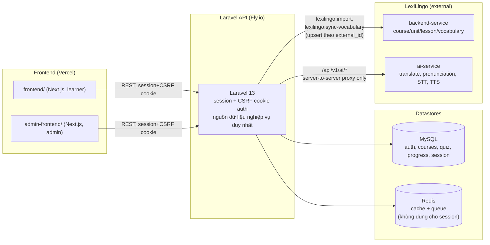
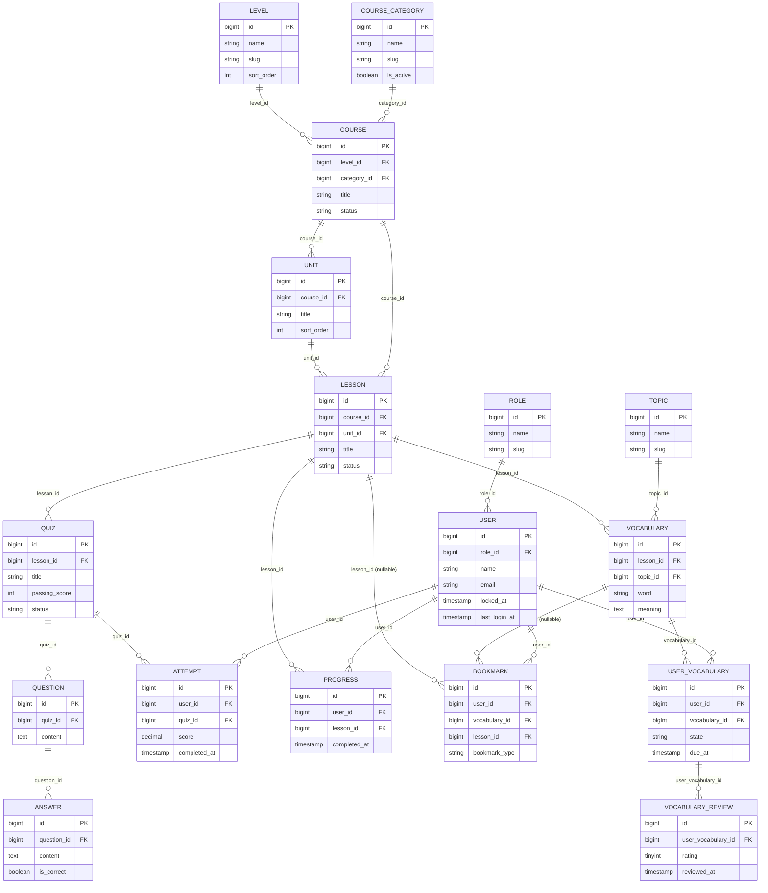

# Kiến trúc hệ thống & lược đồ dữ liệu

Date: 2026-07-29

Tài liệu này chỉ minh họa bằng sơ đồ những gì đã được chốt bằng chữ tại
[`docs/PROJECT_PLAN.md`](PROJECT_PLAN.md) (mục "Kiến trúc tích hợp đã chốt")
— không lặp lại hay mở rộng nội dung đó, chỉ trực quan hóa.

## Sơ đồ kiến trúc hệ thống

Điểm quan trọng minh họa ở đây (đã ghi trong `PROJECT_PLAN.md`, không phải
thông tin mới):

- Laravel là nguồn dữ liệu nghiệp vụ duy nhất; hai frontend chỉ gọi Laravel
  API, không giữ token hay secret của LexiLingo.
- Kết nối tới LexiLingo backend-service là **một chiều, theo lệnh artisan**
  (`lexilingo:import`, `lexilingo:sync-vocabulary`), không phải gọi trực
  tiếp mỗi request — dữ liệu được đồng bộ (upsert theo `external_id`) về
  MySQL rồi phục vụ từ local.
- Kết nối tới LexiLingo ai-service chỉ là proxy server-to-server qua
  `/api/v1/ai/*`; frontend không bao giờ giữ `LEXILINGO_AI_SERVICE_SECRET`.
- Session lưu ở MySQL (`SESSION_DRIVER=database`), **không** ở Redis; Redis
  chỉ phục vụ cache và queue (`CACHE_STORE=redis`, `QUEUE_CONNECTION=redis`
  — xác nhận từ `.env.example`).

## Sơ đồ ERD (lược đồ dữ liệu)

Phạm vi: 16 model thuộc miền học tập cốt lõi — đủ để đọc hiểu learner flow
và admin flow trong [`docs/USER_GUIDE.md`](USER_GUIDE.md). **Không vẽ**
`AuditLog` và `LexiLingoImportCheckpoint`/`LexiLingoImportFailure` — đây là
các bảng vận hành/nội bộ (ghi log hành động admin; bookkeeping cho lệnh
import), không nằm trong luồng nghiệp vụ học tập và không được bất kỳ route
API nào truy vấn trực tiếp.

